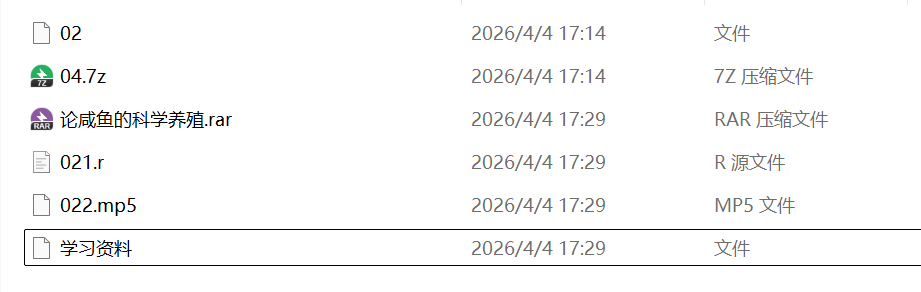

# 开发初衷  

各大论坛的压缩包文件, 考虑到**安全性**等因素, 其上传版本大多:  
1. ".7z"丢失, 需要用户自己重命名  
2. 多层反复加密, 解压过程繁琐, 且重命名整理过于麻烦  
3. 跨用户密码库需求大, 避免手动输入浪费时间  
4. 水印, 命名水印, 广告文件等处理麻烦影响整合  
5. 解压结果可能以初始文件名命名, 如"学习资料", 有自动识别和取用有效命名的需求  
6. 解压软件变化快, 经典python 7z库不能支持分卷解压, 重命名试错浪费用户时间  

# 快速食用指南  
## Setup
1. 下载源码, 无需安装任何依赖  
2. 在jieya.py文件中, 设置**压缩包路径 file_path, 解压路径 extract_path, 密码库 PASSWORDS**  
3. 如有需要, 在garbage_list, 罗列垃圾文件名(包含后缀), 或者垃圾文件规则  
## 使用  
1. python jieya.py  
2. 如需单独执行处理垃圾文件, 文件名格式化等, 按需使用以下命令  
```python 
python jieya.py [extract|purge|rename|all]   # (不带参时默认 all)
```

# 致谢
感谢[toolUnRar](https://github.com/Mario-Hero/toolUnRar)项目的启发, 免去了python库依赖, 提供了分卷解压问题的解决方案 

This software uses 7-Zip (https://www.7-zip.org/)  
7-Zip is licensed under the GNU LGPL license.  

由于WinRar软件采用私有许可证，未经授权不得再分发其可执行文件, 且7z基本覆盖其解压功能, 如有需要可以[自行下载](https://www.rarlab.com/download.htm)

感谢你的使用和宝贵建议!
