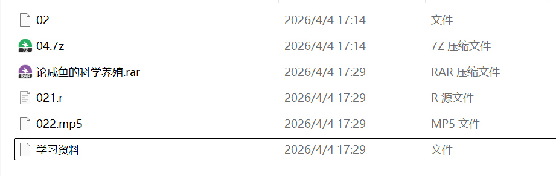

# 开发初衷  

各大论坛的压缩包文件, 考虑到**安全性**等因素, 其上传版本大多:  
1. ".7z"丢失, 需要用户自己重命名  
2. 多层反复加密, 解压过程繁琐, 且重命名整理过于麻烦  
3. 跨用户密码库需求大, 避免手动输入浪费时间  
4. 水印, 命名水印, 广告文件等处理麻烦影响整合  
5. 解压结果可能以初始文件名命名, 如"学习资料", 有自动识别和取用有效命名的需求  
6. 解压软件变化快, 经典python 7z库不能支持分卷解压, 重命名试错浪费用户时间  

# 用户使用方法
> 不需要安装 Python 或任何解压软件, 下载即用 (仅支持 Windows)

## 下载
1. 打开 [Releases 页面](https://github.com/Momordicin/QuickUnzip/releases), 下载最新的 `QuickUnzip-vX.X.X.zip`  
2. 解压到任意位置 (建议放在 D 盘等普通文件夹, 不要放进 `C:\Program Files`, 否则可能没有写入权限)  

解压后的文件夹:
```
QuickUnzip/
├── QuickUnzip.exe     ← 双击运行
├── config.json        ← 设置: 密码库、垃圾文件、路径
├── 待解压/            ← 把压缩包放这里
├── _internal/         ← 程序依赖, 不要动
└── README.md
```

## 使用
- **方式一: 双击**  
  把压缩包放进 `待解压/`, 双击 `QuickUnzip.exe`, 结果在自动生成的 `已解压/` 里  
- **方式二: 拖放**  
  把压缩包 (或装着压缩包的文件夹) 直接拖到 `QuickUnzip.exe` 图标上, 压缩包可以在电脑上任何位置  
  - 拖入文件: 解压到压缩包旁边  
  - 拖入文件夹: 解压到旁边的 `<文件夹名>_已解压/`  
  - 只清理/重命名本次新解压出来的文件夹, 不动旁边原有的文件  
- 运行结束后窗口会显示 "成功 N 个 / 失败 M 个", 按回车关闭  

## 设置 (用记事本打开 `config.json`)
```json
{
    "file_path": "待解压",
    "extract_path": "已解压",
    "passwords": ["密码1", "密码2"],
    "garbage_list": ["广告.txt", "readme.url"]
}
```
- `passwords`: 密码库, 按顺序逐个尝试, 全部失败后再无密码尝试一次  
- `garbage_list`: 解压后自动删除的垃圾文件, 写完整文件名 (包含后缀)  
- `file_path` / `extract_path`: 待解压、已解压文件夹, 可写绝对路径如 `"E:/downloads/tmp"` (用 `/`, 不要用单个 `\`)  
- 注意: 每项之间用英文逗号分隔, 最后一项后面不能有逗号; 写错时程序会提示第几行出错  

## 解压失败怎么办
有失败时, 会在待解压文件夹 (拖放时为压缩包所在文件夹) 写入 `解压失败日志.txt`, 每种失败原因一行:
```
2026-10-08 14:30:05 [密码错误(密码库中没有匹配的密码)] a.7z | b.zip → inner.7z
2026-10-08 14:30:05 [无法识别的格式或解压失败] c.7z
2026-10-08 14:30:05 [分卷不全(请把所有分卷放在同一文件夹)] d.7z.001(缺少 d.7z.002)
```
- **密码错误**: 把正确密码加进 `config.json` 的 `passwords` 后重新运行  
- **分卷不全**: 日志里会写明缺少哪一卷 (如 `a.7z.001(缺少 a.7z.002)`), 补齐后重新运行; 缺最后一卷时文件名上看不出, 会提示"可能缺少最后一卷"  
- **文件不完整**: 下载没完成或文件被截断, 重新下载  
- **压缩包损坏**: 数据校验出错, 重新下载  
- **无法识别的格式**: 该文件可能不是压缩包  

## 常见问题
- **杀毒软件报毒 / Windows 提示"已保护你的电脑"**: 打包程序没有数字签名导致的误报, 点"更多信息 → 仍要运行"; 介意的话可以按下方开发者模式直接运行源码  
- **窗口一闪而过**: 请确认是完整解压后运行, 不要直接在压缩软件里双击 exe  

# 开发者模式
## 环境
- Windows, Python >= 3.8, 运行无需任何第三方库  
- 7z.exe / 7z.dll / UnRAR.exe 已随仓库提供 (查找顺序: 脚本同目录 → PATH → Program Files 默认安装路径)  

## 运行源码
```bash
git clone https://github.com/Momordicin/QuickUnzip.git
cd QuickUnzip
python jieya.py            # 首次运行自动由 config.example.json 生成 config.json
```
`config.json` 是本地文件, 已加入 `.gitignore`, 不会上传; 修改默认模板请编辑 `config.example.json`  

```bash
python jieya.py [extract|purge|rename|all]   # 单独执行解压/垃圾清理/重命名 (不带参时默认 all)
python jieya.py <压缩包或文件夹> ...          # 拖放模式
python jieya.py --no-pause ...               # 结束后不等待回车, 用于脚本调用
```

## 打包 exe
```bash
pip install -r requirements-dev.txt          # 只需要 PyInstaller
python build.py                              # 可选 --version v1.0.0, 默认取 git describe
```
产物:
- `dist/QuickUnzip/`: 可直接运行的程序目录 (onedir 模式; 7z / UnRAR / 配置模板打包在 `_internal/` 中)  
- `dist/QuickUnzip-<version>.zip`: 发布用压缩包  

发布包里的 `config.json` 由 `config.example.json` 生成, 不会带上你本地的 `config.json`  

## 发布新版本
推送 `v` 开头的标签, GitHub Actions (`.github/workflows/release.yml`) 会自动打包并发布到 Releases:
```bash
git tag v1.0.0
git push origin v1.0.0
```

## 项目结构
```
jieya.py               主程序
build.py               打包脚本
config.example.json    配置模板 (首次运行 / 打包时生成 config.json)
7z.exe 7z.dll UnRAR.exe  外部解压工具 (Windows)
7zz 7zzs               7-Zip Linux 版本 (当前未使用)
```

# 致谢
感谢[toolUnRar](https://github.com/Mario-Hero/toolUnRar)项目的启发, 免去了python库依赖, 提供了分卷解压问题的解决方案 

This software uses 7-Zip (https://www.7-zip.org/)  
7-Zip is licensed under the GNU LGPL license.  

This software uses UnRAR (https://www.rarlab.com/rar_add.htm)
UnRAR is freeware with source code, developed by RARLAB (Alexander Roshal).
UnRAR may be used freely, but it may NOT be used to develop a RAR 
(de)compression library or to re-create the RAR compression algorithm.
